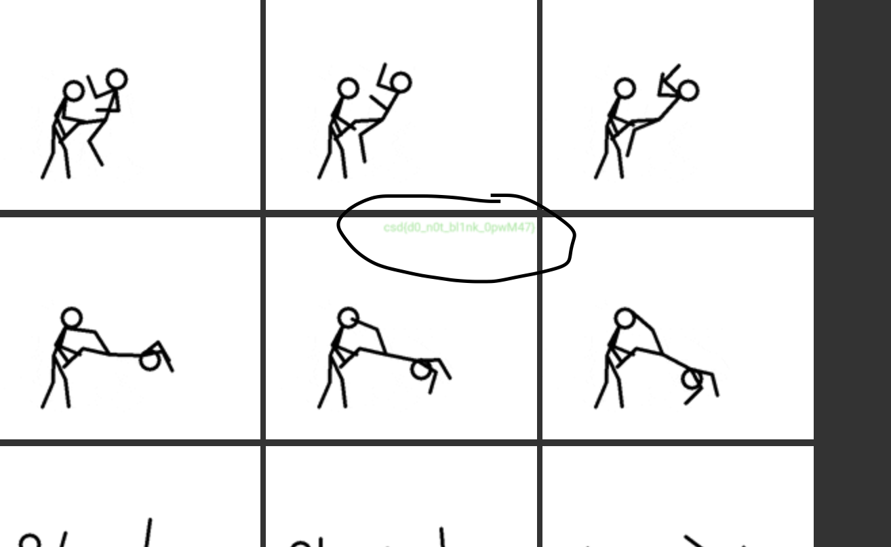

# Zoomed Past Me

- Published: 04/03/2024 (#1/14 in round)
- Category: Steganography
- Points: 25
- Author: Kshau

This GIF file I found appears to display something strange, but that something keeps disappearing. Please help me!

## Attachments

- [ZoomedPastMe.zip](ZoomedPastMe.zip)

## Hint

This hint costed 10 points.

<details>
<summary>Reveal hint</summary>

Use an online tool to split the GIF by frames.

</details>

## Write-up

<details>
<summary>Reveal write-up</summary>

We can use an online GIF splitter like [this](https://ezgif.com/split/ezgif-4-844b9cd06c.gif) to find the flag hidden in the frames. Towards the end of the frames you will find this. 



Flag: ```csd{d0_n0t_bl1nk_0pwM47}```


</details>

Write-up by [Vipin](https://vipin.xyz)
