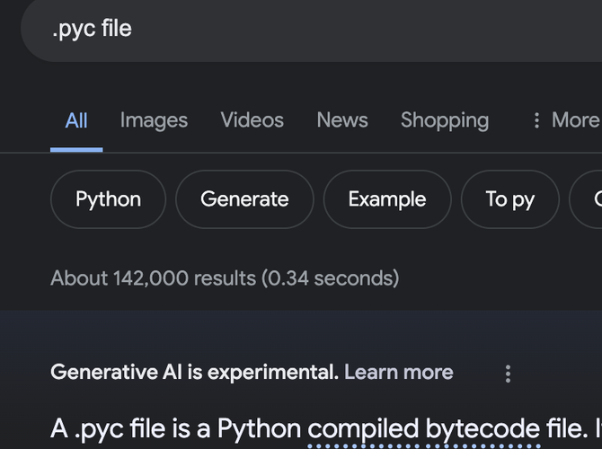
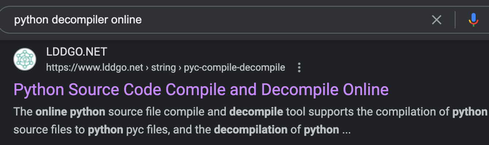
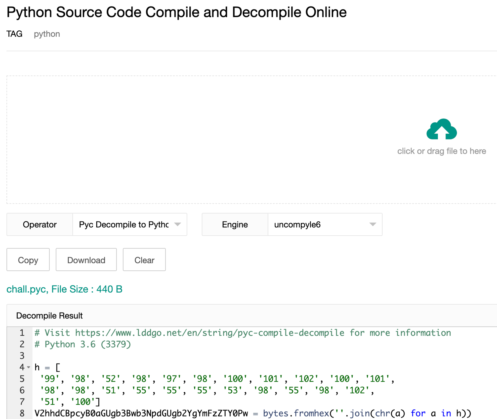
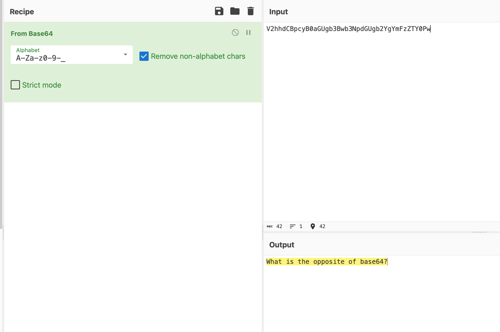
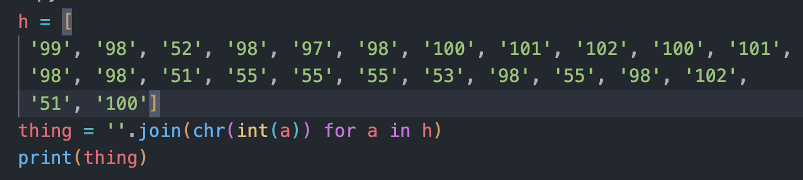
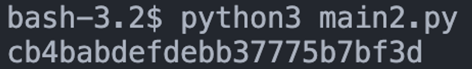
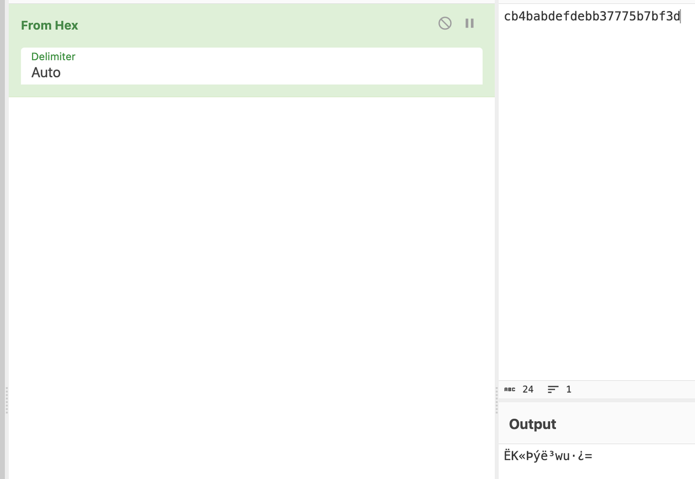
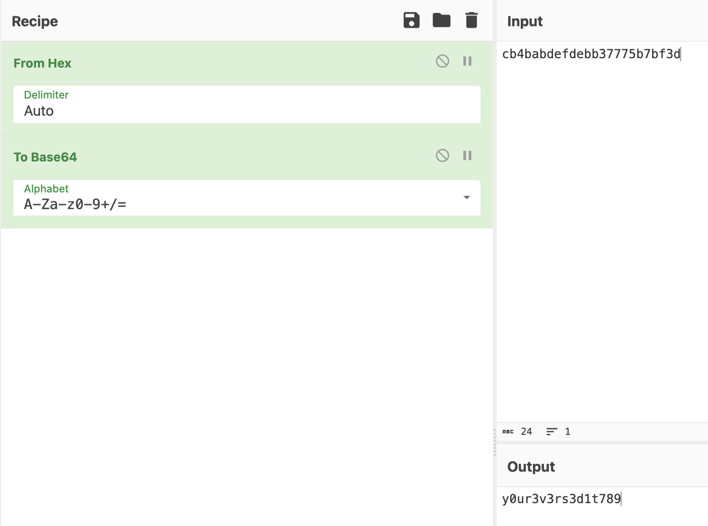

# obfuscated.py

- Published: 04/06/2024 (#4/14 in round)
- Category: Reverse Engineering
- Points: 85
- Author: Mr_MPH

Can you find out the secrets behind this script?

Tip: Wrap in csd{}, you have the flag when the text starts with y

## Attachments

- [chall.pyc](chall.pyc)

## Hint

This hint costed 20 points.

Reveal hint

Don't know what to do with the file? - Decompile it.

Don't know how to decode the text? - Cyberchef and the opposite of decoding.

## Write-up

Reveal write-up

It is a python bytecode, searching it up tells us it is compiled python

Searching for python decompiler we find this

Switching the decompiler to uncompyle6 we get this:

The variable name gives us a hint:

modifying the script a little bit to fix the errors and see what we the original hex was, we can get the hex value:

unhexing it (as hinted by the bytes.fromhex) gives us this:

using the “what is the opposite of base64” hint we can deduce that we encode using base64 (opposite of decoding)

after wrapping in csd{}: `csd{y0ur3v3rs3d1t789}`

Flag: `csd{y0ur3v3rs3d1t789}`

Write-up by Mr_MPH ([link to original](https://mr-mph.notion.site/CyberStudents-CTF-Challenge-Writeup-1-0caf77ee503f429a8454340a52fc52e3?pvs=4))

