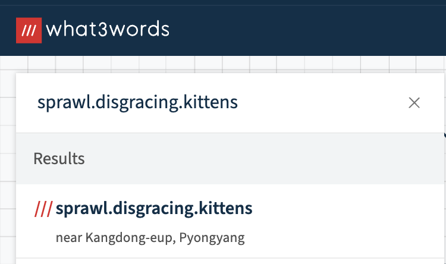

# 3 words

- Published: 05/05/2024 (#2/7 in round)
- Category: Misc.
- Points: 30
- Author: Vipin

My friend sent me this some random words, he says there is a location inside of it. Can you tell me the city?

Flag format: csd{city}

## Attachments

- `sprawl.disgracing.kittens`

## Hint

This hint costed 15 points.

<details>
<summary>Reveal hint</summary>

Check out what3words.com.

</details>

## Write-up

<details>
<summary>Reveal write-up</summary>

In this challenge we are provided with a string with 3 random words seperated by a single dot. To determine what is string is, we can use Google which tells us it is part of a site called What3Words and each combonation of words gives us a location. 



After wrapping the location we found in `csd{}`, you will have the flag.

Flags:```
csd{Kangdong}
csd{kangdong}
csd{kangdong-eup}
csd{Kangdong-eup} ```

</details>

Write-up by [Vipin](https://vipin.xyz)