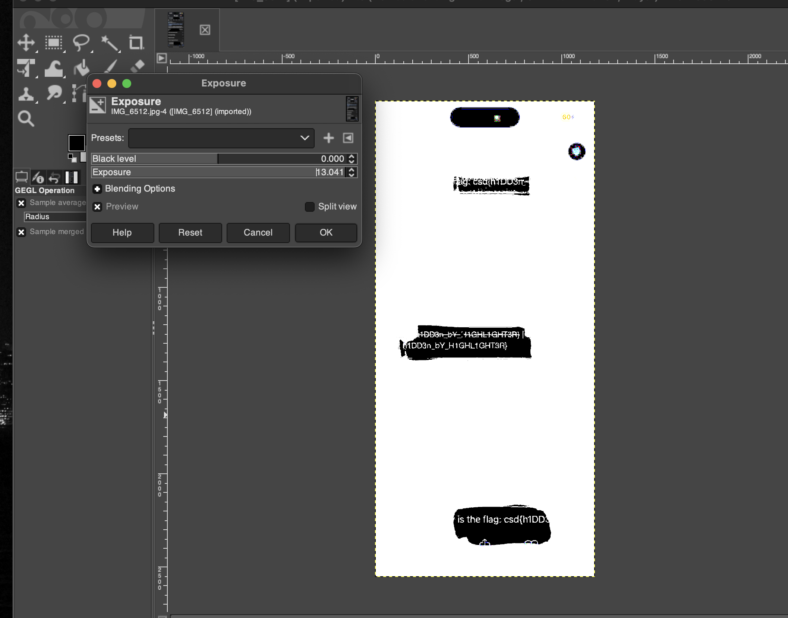

# iphone ss

- Published: 05/22/2024 (#6/7 in round)
- Category: Forensics
- Points: 70
- Author: Vipin

Agent, while examining the logs of a well-known crime boss, we came across this screenshot in his message logs. We believe the blacked-out text might contain crucial information. Can you assist us? -Agent UmFqa3VtYXJp

## Attachments

- [IMG_6512.jpg.zip](IMG_6512.jpg.zip)

## Hint

This hint costed 15 points.

Reveal hint

Search for how to uncover blacked out/highlighted iPhone text, you are bound to find a tutorial on how to do it.

## Write-up

Reveal write-up

The text is blacked out and we need to reveal what is hiding underneath. Let's start by opening our favorite image editing tool (I will be using GIMP).

As you can see all I used was Exposure and increased it to the max setting to reveal what's under the highlighted text and we can piece together the flag to solve the challenge.

Flag: `csd{h1DD3n_bY_H1GHL1GHT3R}`

Write-up by [Vipin](https://vipin.xyz)